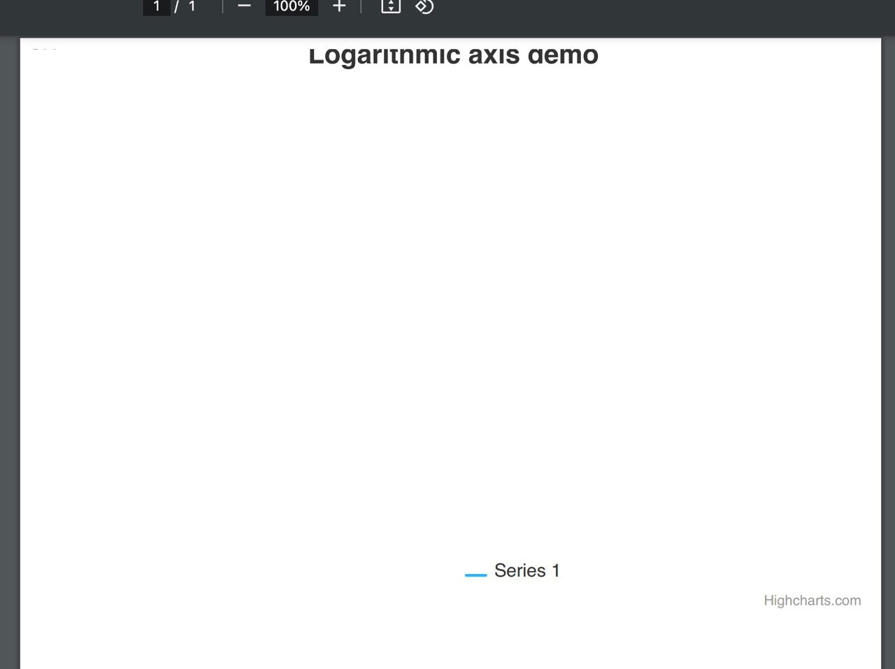
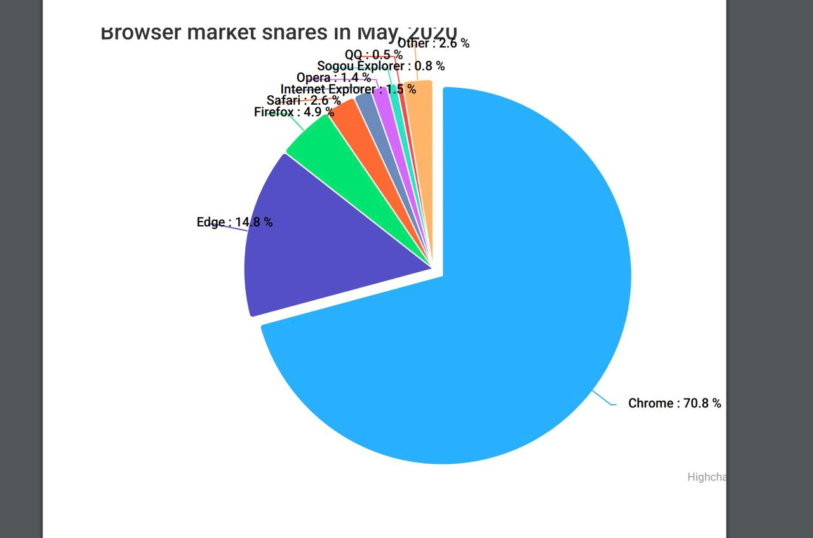

# DOCd implementation #1

## Description
1. Use a Node.js [DOM and HTML](https://dom.spec.whatwg.org/) implementation to provide an API for components. 
1. Use `@vue/server-rendered` to compile the template and all the components into *AST*.
1. Use `html-pdf` | `pdfkit` | `html-to-pdfmake` to export the page in PDF format.

First of, using `@vue/server-rendered`, allowed me to compile Vue components written in [Options API](https://vuejs.org/guide/typescript/options-api). To use components written in [Composition API](https://vuejs.org/api/composition-api-setup) we would need to install a plugin that let's us import **.vue** files, and add a build step to the service.

CONS of theese modules:

- `jsdom` or `happy-dom` are the implementation of the DOM for Node.js
  1. Even though they are the implementation of the DOM, there are needed a lot of work arounds to make it even barely function. ( `happy-dom` is even worse, because it has less things implemented from the DOM) .

- `@vue/server-rendered` does compile the template and we can get `html` from it, with some little inconveniences: 
  1. Doesn't have lifecycle hooks, besides `beforeCreate` and `created`, which are useless to us.
  1. You should not really use `reactivity`, because from the moment that the template has rendered we take the `html` from the in-memory `document`, and make it into a `Buffer` to export as PDF.
  1. Using only [Functional Components](https://blog.logrocket.com/how-to-use-stateless-components-in-vue-js/) we can define the structure, style and 'one-time props' of the components. All the async logic should be defined outside the scope of components, and load them just after we get the respone.

- `html-pdf` given a string of `html` or a `Buffer` it can export a PDF document.
  1. Last release was 3 years ago [html-pdf releases](https://www.npmjs.com/package/html-pdf?activeTab=versions).
  1. [`html-pdf`](https://www.npmjs.com/package/html-pdf?activeTab=readme) is deprecated and it suggest to migrate to newer libraries such as `puppeteer`.

Because Node.js is a javascript runtime and javascript can be run in a browser, we need to overwrite Node.js global object and add a few properties form `jsdom` there.

These properties may be used for cross env usage: `global`, `globalThis`, `window` and in some instances `globalObject`. Also we should create the `document` object which is present on the `window` in browser.

After these preparations it was time to compile a component with a chart and hardcoded data.

There were a big problem, The library that we use to create charts didn't find the window, so it threw an Error, and nothing happend. After some research and different implementations, I patched the window directly in the `highcharts` module.
This time it has a window implementation, but throws an Error because highcharts modules work based on events, and somehow CustomEvent of the polyfilled window was not the same as Browser's window CustomEvent.
So I tried to implement it and patch it inside the highcharts existing code. After this it seems like everything works, I even got `html` of the chart. After trying to render it, there were no series `Line Chart`.

After testing more types of Charts, I got one type that somewhat was working `Pie Chart`.

After patching the window in all the modules from `node_modules/highcharts/modules`, and trying with a more variety of charts, I got more non-descriptive errors ( eg. Highcharts Error #17 ) than actual empty PDFs.

## Conclusion

Building a whole service around these modules, in my opinion is not possible, or at least if you want a service that can export multiple charts on a page at different time for multiple users, and with a clean codebase.

- Pros:
  1. One big PRO of this implementation were, that you didn't need no puppeteer and no headless browser.
  1. The step where you should build the service with [`pkg`](https://www.npmjs.com/package/pkg) it would of been very straight forward and I don't think we would have encountered any deal breakers.

## Verdict
**FAIL**

# DOCd implementation #2

## Description
1. Use [puppeteer](https://www.npmjs.com/package/puppeteer) to start a browser instance, and be free of the burden of partial DOM implementations.
1. Use [unbuild](https://www.npmjs.com/package/unbuild) to build the service.
1. Use [vite](https://www.npmjs.com/package/vite) to build the Vue components in [lib](https://vitejs.dev/config/build-options.html#build-lib) and [UMD](https://jameshfisher.com/2020/10/04/what-are-umd-modules/) module format.

These modules are not mandatory to use, they were used in my investigation, as long as it comes to the same result.

CONS of `puppeteer`:
  1. It needs a lot of space on the hard-drive.
  1. It installs the browser version which he wants and adds it to `node_modules` which can be a problem for future, because `pkg` may not like it.
  1. The browser also weights a lot **~280 MB**.
  1. It installs the versions of browsers that may not be sustained by some of platforms that our clients use.

There may be done some things to remove some of the CONS: 
- We can use [puppeteer-core](https://www.npmjs.com/package/puppeteer-core) to manage the browser ourselves. In this way we can build it from source in builder containers and we can provide the path to `puppeteer-core`

# WIP

